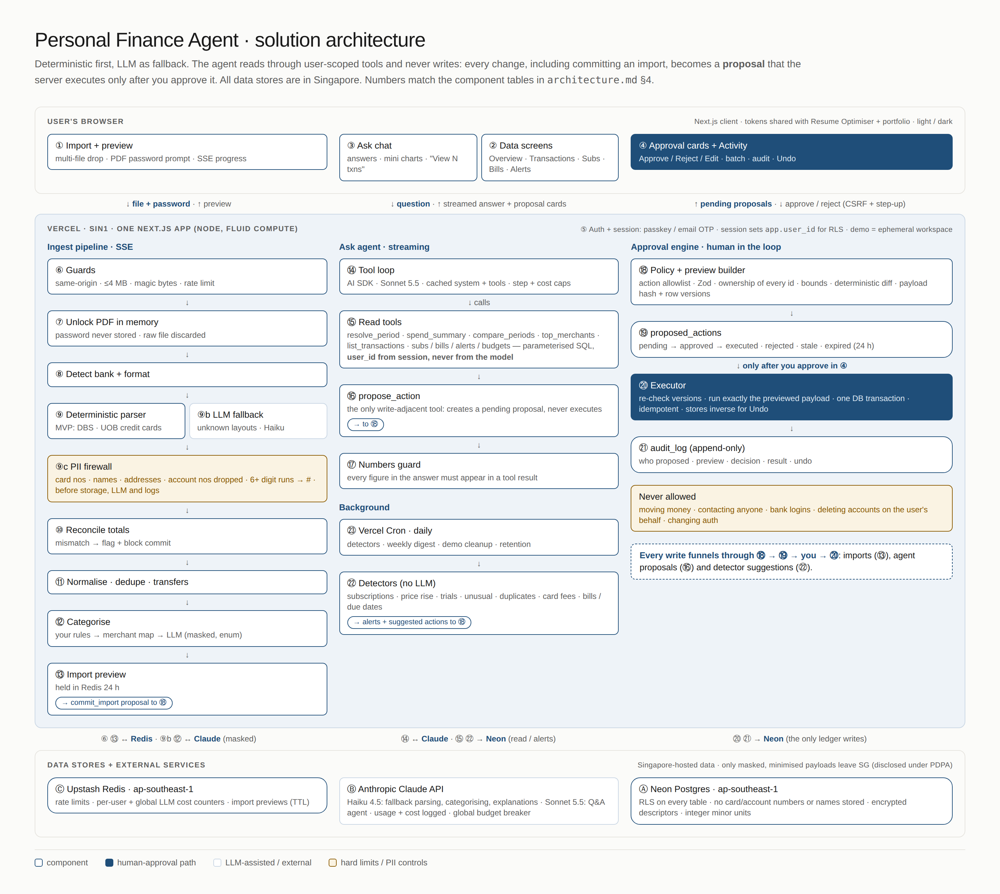
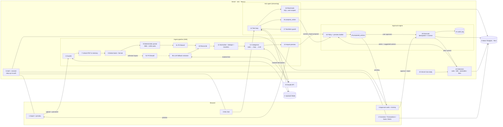
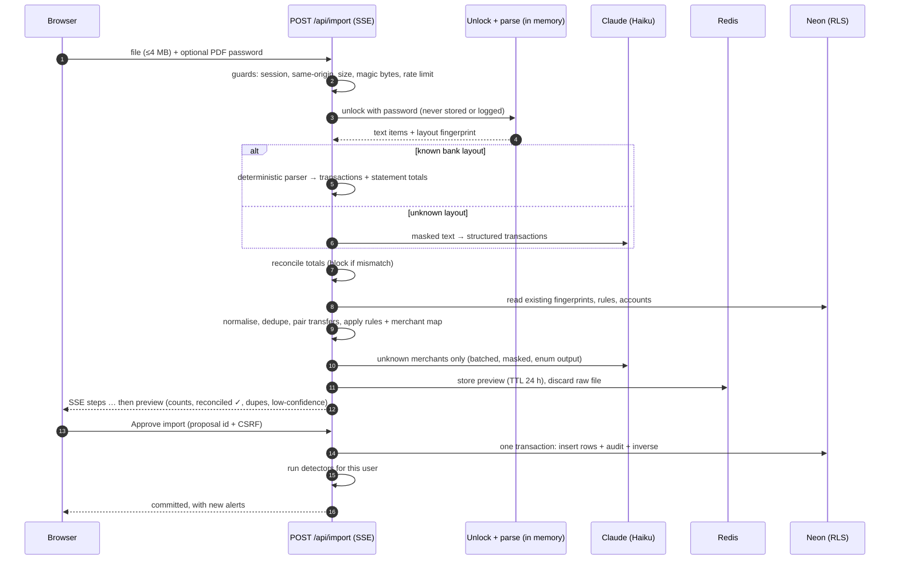
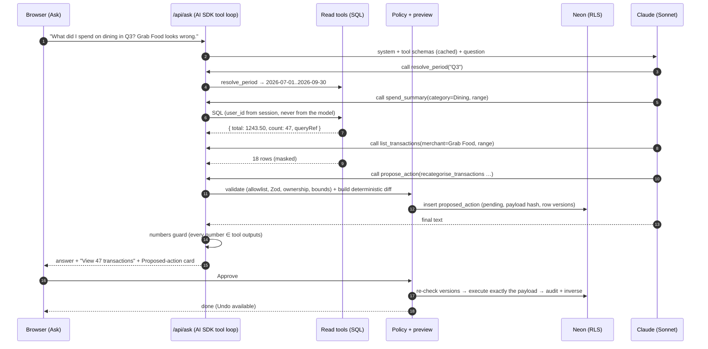
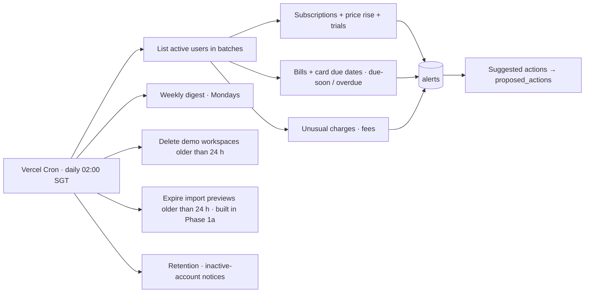
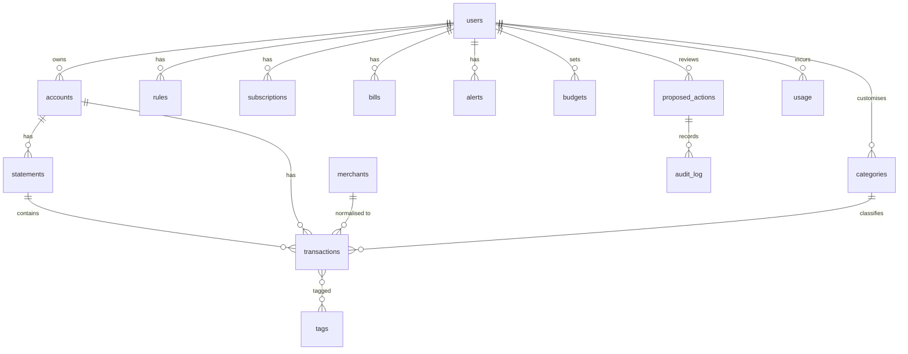
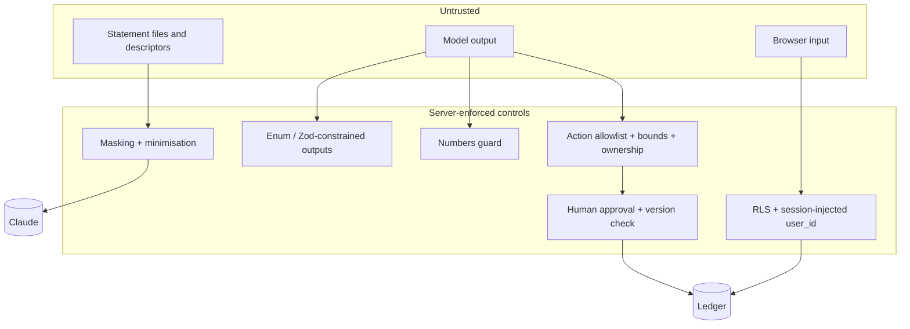

# Architecture: Personal Finance Agent (SG)

This is the high-level target architecture for the app described in [`PRD.md`](PRD.md). It follows the same conventions as the Resume Optimiser: one Next.js App Router app on Vercel, the Vercel AI SDK with `@ai-sdk/anthropic`, Neon Postgres + Drizzle, and Upstash Redis.

Two invariants drive the design:

1. **The LLM never writes data and never does arithmetic.** It reads through typed, account-scoped tools. Any write it wants becomes a *proposal*, which runs only after you approve it.
2. **Deterministic first, LLM as fallback.** Parsing, reconciliation, dedupe, transfers and detectors are plain TypeScript/SQL. The LLM handles only unknown layouts, unknown merchants, explanations and Q&A.



---

## 1. Deployment view

| Zone | What runs there |
|---|---|
| **User's browser** | Next.js client UI: landing, import, overview, transactions, subscriptions, alerts, activity, settings, and the Ask slide-over. Design tokens are shared with the Resume Optimiser and portfolio. |
| **Vercel** (`sin1`, Fluid Compute, Node runtime) | A single Next.js app. It has route handlers for import (SSE), ask (streaming), proposals (approve/reject/undo), export and auth, plus **Vercel Cron** for daily detectors, the digest and demo cleanup. |
| **Neon Postgres** (`aws-ap-southeast-1`, Singapore) | All user data, with **Row-Level Security** per `user_id`; Drizzle ORM + drizzle-kit migrations. Sensitive columns are envelope-encrypted with per-user data keys. |
| **Upstash Redis** (`ap-southeast-1`) | Rate limits (auth, upload, ask, demo per IP), per-user and global monthly LLM cost counters, and short-lived import-preview state. |
| **Anthropic Claude API** | Haiku 4.5 for fallback parsing, categorisation and explanations; Sonnet 5.5 for the Q&A agent. Called through the AI SDK. Data is masked before it leaves. |
| **Email provider** (e.g. Resend) | Auth OTP / magic links only in v1. An optional digest email is P2. |

Every data store is in Singapore. The only cross-border flow is the masked, minimised payload sent to the Claude API, and the privacy notice discloses it.

---

## 2. System flow (end to end)



**Reading the diagram:** every arrow that ends in a **write to the ledger** passes through ⑱ → ⑲ → (your approval) → ⑳. That includes committing an import (⑬), agent proposals (⑯) and detector suggestions (㉒). The only writes outside that path are your own direct edits in the UI (e.g. renaming a category) and system bookkeeping (usage counters, the audit log).

---

## 3. Key sequences

### 3.1 Import a statement



### 3.2 Ask a question, the agent proposes an action, you approve



### 3.3 Daily background run



The detectors are SQL/TS only and make no LLM calls, so the daily run costs no tokens. It is idempotent: alerts are keyed by `(user, type, subject, period)`.

---

## 4. Components

### Browser

| # | Component | Responsibility |
|---|---|---|
| ① | **Import + preview** | Multi-file drop zone; a password prompt per locked PDF; per-file SSE progress; the preview (period, counts, reconciliation, duplicates, transfers, low-confidence rows); Approve. |
| ② | **Data screens** | Overview (960 px column, SVG bars/sparklines in accent tints), Transactions (server-paginated, filterable, inline recategorise), Subscriptions, Bills, Alerts. |
| ③ | **Ask chat** | Slide-over on desktop, full screen on mobile. Streams answer text, figure blocks, mini charts, "View N transactions" links and inline proposal cards. Session-only history. |
| ④ | **Approval cards + Activity** | Renders the server's **structured** preview, never model text: Approve / Reject / Edit, batch select. Activity lists pending items and the audit history with Undo. |

### Server

| # | Component | Responsibility |
|---|---|---|
| ⑤ | **Auth + session** | Email OTP / magic link + passkeys (Better Auth in Neon ★). Sets the `app.user_id` session variable for RLS. Requires step-up re-auth for export, delete, and approvals touching more than 100 rows. Demo sessions are ephemeral. |
| ⑥ | **Guards** | Same-origin check, ≤ 4 MB, `%PDF-`/CSV/XLSX magic bytes, ≤ 30 pages, Upstash rate limit, per-user upload quota. |
| ⑦ | **Unlock** | pdf.js/unpdf opens the PDF with the user's password in memory. The password and file bytes are dropped after parsing. Scanned/image-only files are rejected. |
| ⑧ | **Detect bank + format** | Fingerprints header text, layout and column labels to pick a `(bank, product, version)` parser. |
| ⑨ | **Deterministic parsers** | One module per bank and format. **MVP: DBS and UOB credit-card PDFs** ([`statement-formats.md`](statement-formats.md)); OCBC and bank accounts (PDF + CSV) come in Phase 2. Outputs `ParsedCardStatement` (rows + printed totals + due date/min payment). It has no field for card numbers, names or addresses. |
| ⑨b | **LLM fallback extractor** | Page text, **after the PII firewall** → the same schema via structured output on Haiku. Always marked "AI-extracted". |
| ⑨c | **PII firewall** | Runs on every string before storage, before any LLM call and before logging. It masks Luhn-valid card numbers, NRIC/FIN, postal codes, emails, phone numbers, account numbers in payment rows, and the cardholder names seen in this upload (held in memory only). It replaces 6+ digit runs in descriptors with `#`. A surviving hit blocks the import with an error code. |
| ⑩ | **Reconcile** | Bank: opening + Σ = closing. Card: previous − credits + charges = new balance. On mismatch it flags and blocks one-click commit. This is the verifier for ⑨b too. |
| ⑪ | **Normalise, dedupe, transfers** | Converts to minor units and dates in SGT, applies the FX fields, builds the exact fingerprint, scores fuzzy near-duplicates, and pairs transfers / card payments across accounts. |
| ⑫ | **Categorise** | User rules → curated merchant map → batched Haiku classifier (enum of your categories + confidence) → Uncategorised. Masking runs before the LLM. |
| ⑬ | **Import preview** | Holds the parsed result in Redis (TTL 24 h) and creates a `commit_import` proposal. |
| ⑭ | **Ask tool loop** | AI SDK `streamText` with tools on Sonnet 5.5. The system prompt and tool schemas are cached. A step limit (e.g. 8) and per-user cost checks apply. |
| ⑮ | **Read tools** | `resolve_period`, `spend_summary`, `compare_periods`, `top_merchants`, `list_transactions`, `get_subscriptions`, `get_bills`, `get_alerts`, `get_budgets`, `list_categories`. Parameterised SQL only, with `user_id` taken from the session. Results are masked and capped in size, and each carries a `queryRef` for the "View N" link. |
| ⑯ | **propose_action** | The agent's **only** write-adjacent tool. It creates a pending proposal, never executes one. |
| ⑰ | **Numbers guard** | Extracts the numbers from the final answer and checks each against the tool outputs (with tolerance for rounding and formatting). On failure it regenerates once, then falls back to rendering the tool table. |
| ⑱ | **Policy + preview builder** | Allowlist of action types, Zod validation, ownership of every ID, bounds, and a deterministic diff. Stores the payload hash and the row versions it was based on. |
| ⑲ | **`proposed_actions`** | States: `pending → approved → executed`, or `rejected`, `expired`, `stale`, `failed`. Expires after 24 h. |
| ⑳ | **Executor** | Runs only on an approval POST from the owner (with CSRF + idempotency key). Re-checks row versions, executes **exactly** the stored payload in one DB transaction, and writes the inverse for Undo. |
| ㉑ | **`audit_log`** | Append-only, enforced by a DB trigger that blocks UPDATE/DELETE except during account wipe. Records the proposer (agent, detector or user), preview, decision, result and undo. |
| ㉒ | **Detectors** | Subscriptions, price rise, trial conversion, unusual charge, duplicates, card fees, bills and due dates. Pure functions over SQL results that write alerts and *suggested* proposals. |
| ㉓ | **Cron** | Daily detectors, the weekly digest, demo workspace cleanup and retention jobs. |

### External

| # | Service | Notes |
|---|---|---|
| Ⓐ | **Neon Postgres** (SG) | RLS on every table; per-user DEKs wrapped by `MASTER_KEY`. |
| Ⓑ | **Claude API** | Model per route via env; usage and cost logged per call; global breaker. |
| Ⓒ | **Upstash Redis** (SG) | Rate limits, cost counters, import previews. |

---

## 5. Data model (high level)



| Table | Key fields (sketch) |
|---|---|
| `accounts` | bank, product name as printed (the only card identifier), ordinal, type (deposit/card), currency, nickname_enc. **No card or account number, not even last-4.** |
| `statements` | account, period_start/end, file_sha256, parser `(bank, product, version)`, reconciled, totals, due_date, min_payment |
| `transactions` | user, account, statement, txn_date, post_date, `amount_minor` (bigint, signed), currency, fx_amount_minor, fx_currency, `descriptor_enc`, merchant_id, category_id, category_source (rule/map/llm/user), confidence, is_transfer, transfer_group, fingerprint, `version` |
| `merchants` | normalised name, scope (global/user), default category |
| `rules` | match (merchant or descriptor pattern), category, priority, created_via (proposal id) |
| `subscriptions` / `bills` | merchant/payee, cadence, expected amount, next date, status |
| `alerts` | type, subject ref, reason, status, dedupe key |
| `proposed_actions` | type, payload (jsonb), payload_hash, preview (jsonb), base_versions, status, proposer, expires_at |
| `audit_log` | proposal, actor, event, before/after refs, inverse (jsonb), ts |
| `usage` | user, route, model, tokens in/out/cache, cost_usd |

---

## 6. Trust boundaries and controls



- **The model can't write.** Its tools are read-only plus `propose_action`, and execution needs an authenticated POST from you.
- **The model can't see other users.** `user_id` is never a tool argument, and RLS blocks other users' rows even if the app has a bug.
- **The model can't make up numbers.** Figures come from tools, the numbers guard checks the answer, and each answer links to its source rows.
- **Statement text can't steer the agent.** It is treated as data, categorisation outputs are enum-constrained, and proposals are previewed deterministically.

---

## 7. Proposed file tree (top level)

```
src/
  app/                    # routes: (marketing) landing/privacy, app/*, api/{import,ask,proposals,export,cron}
  components/             # shell, Reveal, charts (SVG), ApprovalCard, TransactionTable
  server/
    auth/                 # Better Auth config, session → app.user_id
    db/                   # drizzle schema, RLS policies, encrypted column helpers
    ingest/               # guards, unlock, detect, parsers/{dbs,uob}/card-pdf (MVP), pii-firewall, fallback, reconcile, normalise, dedupe, transfers
    categorise/           # rules, merchant map, llm classifier, masking
    detectors/            # subscriptions, anomalies, fees, bills
    agent/                # ask loop, tools/*, numbers-guard, prompts
    actions/              # registry (allowlist), schemas, preview builders, executor, inverse, audit
    llm/                  # model config, pricing.ts, cost meter, breaker
  schemas/                # shared Zod types (ParsedStatement, Proposal, events)
evals/fixtures/synthetic/ # 12 months of synthetic DBS + UOB card statements, .expected.json per PDF, ledger.json of planted events
evals/                    # golden statements, category set, subscription set, Q&A set + SQL ground truth
scripts/check-no-pii.mjs  # blocks personal data from the public repo (also runs in CI)
tests/                    # unit, RLS isolation, unapproved-write, e2e (Playwright)
```
